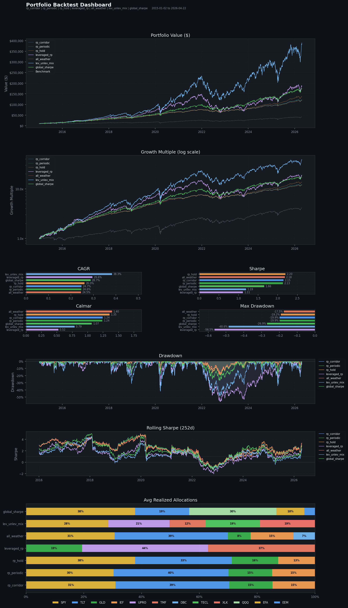

# allocator

A portfolio backtesting engine with multi-mode rebalancing, mean-variance optimization, and side-by-side strategy comparison.



## Overview

allocator simulates realistic portfolio behavior over historical price data. Each portfolio is independently configured with its own tickers, target weights, rebalancing strategy, and optional optimizer. Results are compared side by side across all strategies.

**Core features:**

- Corridor, periodic, hybrid, and no-rebalance modes
- Rebalance to target weights or corridor band edge (minimize turnover)
- Mean-variance optimization: max Sharpe, max Sortino, min vol, equal weight
- Per-asset or lazy global weight bounds fed directly to the optimizer
- Band search: parameter search over corridor widths scored by Sharpe, CAGR, Calmar, or Sortino
- Periodic contributions with smart (fill underweight first) or pro-rata allocation
- Performance metrics: CAGR, Sharpe, Sortino, Calmar, max drawdown, rebalance frequency

## Rebalancing Modes

| Mode | Behavior |
|---|---|
| `corridor` | Rebalance immediately when any weight breaches its band |
| `periodic` | Rebalance on a fixed schedule (monthly or quarterly) |
| `hybrid` | Check bands daily, execute only on schedule if breach occurred |
| `none` | Buy and hold -- no rebalancing |

Corridor bands can be **absolute** (`target +/- band`) or **relative** (`target +/- band * target`).

## Portfolios

The default config runs eight strategies over the same date range:

| Portfolio | Mode | Optimizer | Description |
|---|---|---|---|
| `corridor_relative` | corridor | max Sharpe | Relative bands, optimized weights |
| `periodic_minvol` | periodic | min vol | Quarterly rebalance, minimum variance |
| `buy_and_hold` | none | none | Passive baseline |
| `all_weather` | corridor | none | Ray Dalio All Weather |
| `sixty_forty` | periodic | none | Classic 60/40 |
| `golden_butterfly` | corridor | none | Rebalances to band edge |
| `permanent_portfolio` | hybrid | none | Harry Browne four-quadrant |
| `global_growth` | corridor | max Sharpe | Global diversification, band search |

## Quickstart

```bash
git clone https://github.com/JaredRudolph/allocator.git
cd allocator
uv run main.py
```

Results are saved to `data/processed/`. The dashboard is saved to `assets/dashboard.png`.

## Configuration

All behavior is controlled through `config.py`. Each portfolio is a self-contained dict:

```python
portfolios = [
    {
        "name": "my_portfolio",
        "tickers": ["SPY", "TLT", "GLD"],
        "weights": {"SPY": 0.50, "TLT": 0.30, "GLD": 0.20},
        "benchmark": "SPY",
        "start": "2015-01-01",
        "end": None,
        "initial_capital": 10_000,
        "risk_free_rate": 0.0,
        "contribution": {
            "amount": 500,
            "frequency": "M",   # M | Q | None
            "method": "smart",  # smart | pro_rata
        },
        "rebalance": {
            "mode": "corridor",           # none | periodic | corridor | hybrid
            "threshold_type": "relative", # absolute | relative
            "band": 0.10,
            "rebalance_to": "target",     # target | band_edge
            "schedule": "Q",
        },
        "optimize": {                     # omit to use fixed weights
            "objective": "max_sharpe",    # max_sharpe | max_sortino | min_vol | equal_weight
            "weight_bounds": {"min": 0.25, "max": 1.75},  # lazy global
        },
        "band_search": {                  # omit to skip
            "metric": "sharpe",           # sharpe | cagr | calmar | sortino
            "band_range": [0.02, 0.25],
            "steps": 20,
        },
    },
]
```

## Project Structure

```
allocator/
├── main.py                 # entry point
├── config.py               # portfolio definitions
├── src/allocator/
│   ├── data.py             # price fetching (yfinance)
│   ├── optimize.py         # mean-variance optimizer
│   ├── rebalance.py        # corridor and schedule logic
│   ├── backtest.py         # simulation loop
│   ├── metrics.py          # CAGR, Sharpe, Calmar, Sortino, drawdown
│   ├── band_search.py      # parameter search over band widths
│   ├── pipeline.py         # multi-portfolio orchestrator
│   └── plots.py            # dashboard visualization
├── tests/
├── data/
│   ├── raw/                # price cache (gitignored)
│   └── processed/          # backtest output (gitignored)
└── assets/
    └── dashboard.png
```

## Dependencies

- `yfinance` -- market data
- `pandas`, `numpy` -- data manipulation
- `scipy` -- portfolio optimization
- `matplotlib` -- dashboard plots
- `loguru` -- logging
- `pyarrow` -- parquet output

```bash
uv run pytest        # run tests
uv run ruff check .  # lint
uv run ruff format . # format
```
